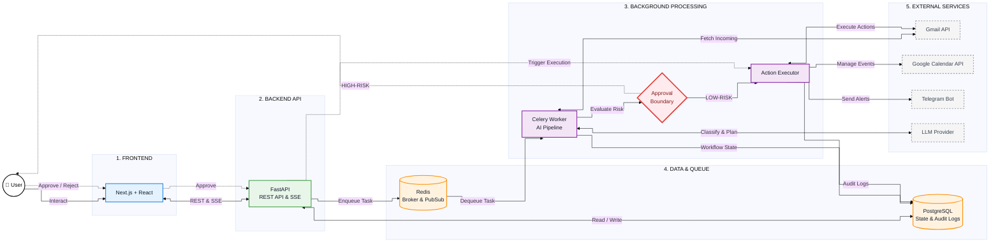

# InboxPilot

> "Don't just read your inbox. Act on it."

InboxPilot is an AI-powered email workflow agent that transforms an inbox into an autonomous workflow system. It reads incoming emails, classifies their intent, extracts relevant information, plans appropriate actions, evaluates safety and risk, executes low-risk reversible actions automatically, and routes irreversible or external-facing actions through human approval.

The central architectural principle is:  
**AI proposes → Safety layer evaluates → Human approves when required → System executes → Everything is audited**

---

## Core Features

### 1. Email Ingestion
- **Gmail API Integration**: Securely fetches emails via OAuth 2.0.
- **Asynchronous Processing**: Ingestion happens in the background via a Celery Beat schedule (polling every 30 seconds).
- **Persistent Storage**: Emails are saved locally to PostgreSQL, with sensitive fields protected by AES-256-GCM encryption.

### 2. AI Email Classification
Incoming emails are evaluated by an LLM and strictly categorized. The AI also returns a confidence score and its reasoning.
- `BILL` (Invoices and payment requests)
- `MEETING` (Calendar invitations and scheduling requests)
- `FORM` (Deadlines and document requests)
- `REMINDER` (Tasks and follow-ups)
- `SPAM` (Promotional or junk)
- `OTHER` (Uncertain or unstructured)

### 3. Action Planning
Based on the classification, the AI extracts parameters to populate a strict Pydantic `ActionPlan`. Supported actions:
- **Log Bill**: Extracts amount, currency, vendor, and due date.
- **Create Calendar Event**: Extracts title, start time, end time, and description.
- **Draft Reply**: Generates contextual email responses.
- **Create Reminder**: Extracts reminder text and date.
- **Archive**: Archives an email if no action is needed.
- **No Action**: Halts the workflow.

### 4. Safety & Risk Evaluation
The system employs a reversibility-based safety mechanism:
- **Low-Risk / Reversible**: Actions like archiving or setting a local reminder are executed automatically.
- **High-Risk / Irreversible**: Actions that mutate external state (drafting replies, creating calendar events) require explicit human approval.
- **Low-Confidence**: If the model confidence falls below the `LLM_CONFIDENCE_THRESHOLD`, the action is safely routed for review.

### 5. Human-in-the-Loop Approval
- Workflows blocked by high-risk boundaries enter a pending approval queue.
- Users can review the AI's reasoning and planned parameters via the Next.js dashboard.
- Execution is hard-blocked until the `Approve` state transition is triggered.
- Real-time alerts are sent via Telegram notifications.

### 6. Audit Logs
The system maintains an immutable history in PostgreSQL for:
- AI classifications, prompts, and decisions.
- Safety evaluations and risk scoring.
- Human approvals or rejections.
- Action executions, outcomes, and failure states.

### 7. Real-Time Updates
- **Server-Sent Events (SSE)** provide real-time updates to the Next.js frontend.
- Users instantly see when an email is ingested, a workflow advances, or an approval is required without refreshing the page.

### 8. Background Processing
- Utilizes **Celery** with a **Redis** message broker.
- Keeps the REST API highly responsive by offloading slow LLM inferences and external API calls to background workers.

### 9. Database
- Powered by **PostgreSQL** (via SQLAlchemy).
- Core entities: `User`, `Email`, `Action`, `Approval`, `AuditLog`, `UserSettings`.

### 10. Integrations
- **Gmail API**: OAuth 2.0 based fetching, drafting, and archiving.
- **Google Calendar API**: Event scheduling.
- **Telegram Bot API**: Push notifications and approval requests.
- **LLM Provider**: Supports primary (Groq) and fallback (Gemini) providers for resilient reasoning.

---

## Tech Stack

| Layer | Technology | Purpose |
|------|------------|---------|
| **Frontend** | Next.js, React, Tailwind CSS | UI dashboard and interactive approvals |
| **Backend API** | FastAPI, Pydantic, SQLAlchemy | REST API, SSE endpoints, database ORM |
| **AI / LLM** | Groq, Gemini (Fallback) | Classification, action extraction, reasoning |
| **Database** | PostgreSQL | Persistent storage of emails, state, audits |
| **Queue** | Redis | Message broker and pub/sub transport |
| **Background Workers** | Celery | Asynchronous task execution and periodic scheduling |
| **Authentication** | OAuth 2.0, SessionMiddleware | Google authentication and API authorization |
| **Real-time** | Server-Sent Events (SSE) | Push notifications to the frontend |

---

## Architecture

The system utilizes a production-oriented left-to-right flow that clearly isolates the web layer, asynchronous workers, and persistent data boundaries.



---

## End-to-End Workflow

1. **Email Arrives**: A new email reaches the user's Gmail inbox.
2. **Ingestion**: The Celery Beat scheduler triggers the ingestion task. The email is fetched via the Gmail API and saved to PostgreSQL.
3. **Queueing**: The backend enqueues a processing task into Redis.
4. **Classification**: A Celery worker processes the task, prompting the LLM to classify the email.
5. **Planning**: The LLM extracts required parameters (e.g., event times, amounts) to generate a strict action plan.
6. **Safety Evaluation**: The system evaluates confidence scores and determines if the action is `LOW`, `MEDIUM`, or `HIGH` risk.
7. **Decision Branching**:
   - **Low-risk**: Automatically forwarded to the Action Executor.
   - **High-risk**: Enters the pending approval queue; an alert is sent via Telegram.
8. **Human Approval**: The user reviews the AI's reasoning on the dashboard and clicks "Approve".
9. **Execution**: The backend API confirms the state transition and triggers the Action Executor.
10. **External Output**: The executor performs the action via Google Calendar or Gmail APIs.
11. **Auditing**: Every step, state change, and API response is logged immutably in the database.

---

## Safety Model

| Action Type | Behavior | Example |
|-------------|----------|---------|
| **Low-risk / Reversible** | Automatic execution | Archive email, create local reminder |
| **High-risk / Irreversible** | Human approval required | Draft reply, schedule calendar event |
| **Low-confidence** | Human review required | Ambiguous unstructured email |

---

## Security

- **Strict Validation**: All AI outputs and client inputs are rigorously validated using Pydantic (`ConfigDict(extra="forbid")`, strict type boundaries).
- **Authentication**: Secured via Google OAuth 2.0 and signed `SessionMiddleware`.
- **Data Encryption**: Email fields are encrypted at rest using AES-256-GCM.
- **Rate Limiting**: Configured using `slowapi` to protect FastAPI routes.
- **Middleware Protections**: Employs hardened security headers (`X-Content-Type-Options`, `X-Frame-Options`, `X-XSS-Protection`) and specific CORS policies.
- **Approval Boundaries**: High-risk actions cannot be bypassed; state transitions are validated at the database level before execution.

---

## Data Privacy

Connected integrations are used only for the workflow capabilities enabled by InboxPilot. 
- **Gmail access** is strictly used to fetch incoming emails, draft replies, and apply labels/archive.
- **Google Calendar access** is used exclusively to schedule events proposed by the AI.
- **Telegram** is used solely to dispatch approval notifications.

---

## Environment Variables

Configure these values in your `backend/.env` file.

### Application
- `APP_NAME` - Display name of the application.
- `ENVIRONMENT` - e.g., `development` or `production`.
- `DEBUG` - Enable debugging features (`true`/`false`).
- `SESSION_SECRET` - Cryptographic secret for signing session cookies (e.g., `your_random_secret`).
- `EMAIL_ENCRYPTION_KEY` - Base64 encoded AES-256-GCM key for database encryption.

### Database
- `DATABASE_URL` - Production PostgreSQL connection string.
- `LOCAL_DATABASE_URL` - Local development PostgreSQL string.

### Redis
- `REDIS_URL` - Connection string for the Celery message broker and SSE pub/sub.

### Google OAuth & APIs
- `GOOGLE_CLIENT_ID` - Google Cloud Console OAuth client ID.
- `GOOGLE_CLIENT_SECRET` - Google Cloud Console OAuth client secret.
- `GOOGLE_REDIRECT_URI` - OAuth callback URL (e.g., `http://localhost:8000/auth/gmail/callback`).
- `OAUTHLIB_INSECURE_TRANSPORT` - Set to `1` for local HTTP testing.

### LLM Provider
- `LLM_PROVIDER` - Primary LLM provider (e.g., `groq`).
- `LLM_MODEL` - Primary model (e.g., `openai/gpt-oss-120b`).
- `LLM_API_KEY` - Your primary LLM API key.
- `LLM_FALLBACK_PROVIDER` - Fallback provider (e.g., `gemini`).
- `LLM_FALLBACK_MODEL` - Fallback model.
- `LLM_FALLBACK_API_KEY` - Fallback API key.
- `LLM_CONFIDENCE_THRESHOLD` - Minimum float value to bypass review (e.g., `0.85`).
- `LLM_TIMEOUT_SECONDS` - Request timeout (e.g., `20`).
- `LLM_MAX_RETRIES` - Max API retries (e.g., `2`).

### Telegram
- `TELEGRAM_BOT_TOKEN` - Bot token provided by BotFather.
- `TELEGRAM_BOT_USERNAME` - The bot's public username.

---

## Local Development

### Prerequisites
- Python 3.10+
- Node.js 20+
- PostgreSQL
- Redis

### Database Setup
Ensure PostgreSQL is running and `LOCAL_DATABASE_URL` is set in your `.env`.
```bash
cd backend
alembic upgrade head
```

### Backend Setup
```bash
cd backend
pip install -r requirements.txt
uvicorn app.main:app --reload
```

### Worker Setup
In a separate terminal, start the Celery worker and the Beat scheduler:
```bash
cd backend
celery -A app.workers.celery_app worker --loglevel=info
celery -A app.workers.celery_app beat --loglevel=info
```

### Frontend Setup
```bash
cd frontend
npm install
npm run dev
```

---

## Deployment

InboxPilot is structured for standard containerized or PaaS deployments (e.g., Render, Railway).
- **API Service**: Runs FastAPI with Uvicorn. Honors the injected `$PORT` environment variable.
- **Worker Service**: Executes the Celery worker and Celery Beat processes.
- **Database**: Connects to a managed PostgreSQL instance (utilizing `postgresql+psycopg` for connection stability).
- **Queue**: Connects to a managed Redis instance (e.g., Upstash) using `rediss://` for TLS.
- **Healthchecks**: Handled automatically via the `/health` endpoint on the API service.

---

## API Reference

### Authentication
- `GET /auth/gmail/login` — Redirects to Google OAuth consent screen.
- `GET /auth/gmail/callback` — Handles OAuth callback and establishes the secure session.

### Dashboard & Health
- `GET /` — Root welcome message.
- `GET /health` — Service healthcheck endpoint.
- `GET /api/dashboard` — Fetches aggregate metrics for the UI.

### Emails
- `GET /api/emails` — Lists ingested and processed emails.
- `GET /api/emails/{id}` — Fetches specific email context and parameters.

### Workflows & Approvals
- `GET /api/approvals` — Lists workflows blocked in the pending state.
- `POST /api/approvals/{id}/approve` — Approves a high-risk action and triggers the execution pipeline.
- `POST /api/approvals/{id}/reject` — Rejects the planned action, aborting execution.

### Audit Logs
- `GET /api/audit` — Retrieves the immutable log of system events.

### Integrations
- `GET /api/integrations` — Checks active connectivity for Gmail, Calendar, and Telegram.
- `GET /api/settings` — Fetches current user and environment settings.
